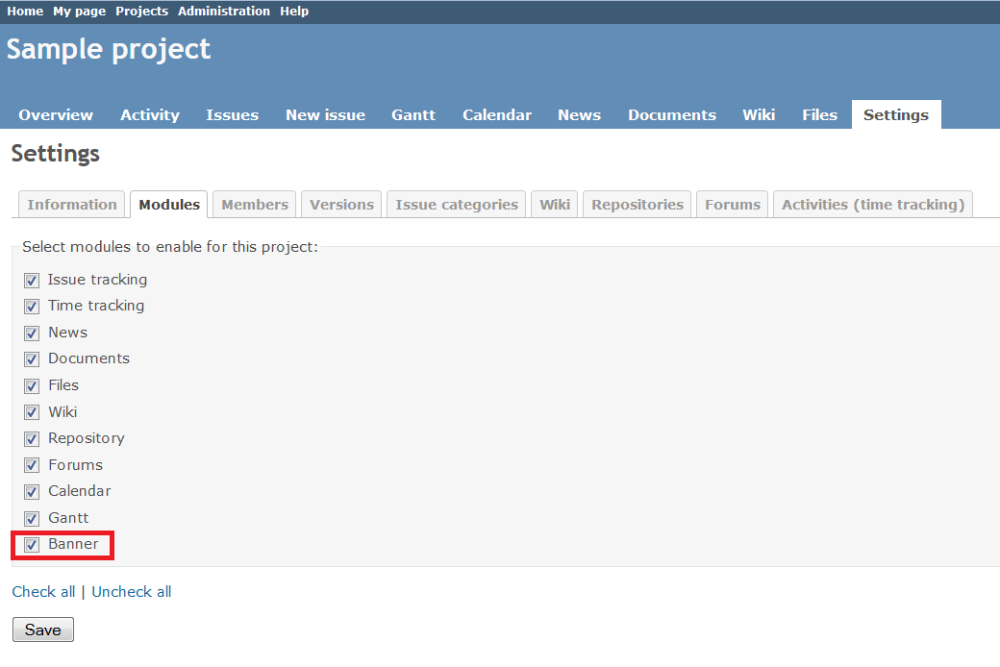

# Redmine Banner Plugin 

This plugin is used to show site-wide messages from the Redmine administrator, such as maintenance information messages or notifications.

## Compatibility

This plugin version is compatible only with Redmine 2.1.0 and later.

## Installation

1. To install the plugin
    * Download the .ZIP archive, extract files and copy the plugin directory into #{REDMINE_ROOT}/plugins.
    
    Or

    * Change you current directory to your Redmine root directory:  

            cd {REDMINE_ROOT}
            
      Copy the plugin from GitHub using the following commands:
      
            git clone https://github.com/Undev/redmine_banner.git plugins/redmine_banner
            
2. Update the Gemfile.lock file by running the following commands:  

         rm Gemfile.lock  
         bundle install
            
3. This plugin requires a migration. Run the following command to upgrade your database (make a database backup before):  

        bundle exec rake redmine:plugins:migrate RAILS_ENV=production 

4. Restart Redmine.

Now you should be able to see the plugin in **Administration > Plugins**.

## Usage

The plugin enables you to create a global banner and/or project banners.

To create a global banner, go to **Administration > Plugins** and click the **Configure** link, or go directly to **Administration > Banner**:  

Configure the global banner as needed. To activate the banner and make it visible, select the **Activate** check box and click **Apply**.  

The banner will be displayed on all Redmine pages. You can click **Edit** on the banner to change its settings or click **Off** to turn off the banner.  

To create a project banner, you should first enable the corresponding module. Go to the **Modules** tab of the project settings, select the **Banner** check box and click **Save**.  

Switch to the **Banner** tab and configure the project banner as needed. To activate the banner and make it visible, select the **Activate** check box and click **Apply**.  

The project banner will be displayed on the corresponding project pages. You can click **Edit** on the banner to change its settings or click **Off** to turn off the banner.  

## License

This software is licensed under the GNU GPL v2. See COPYRIGHT and COPYING for details.